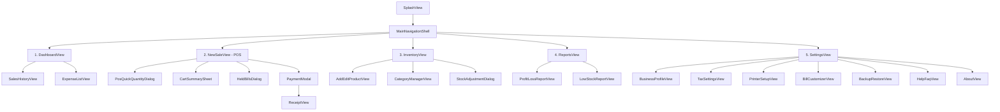
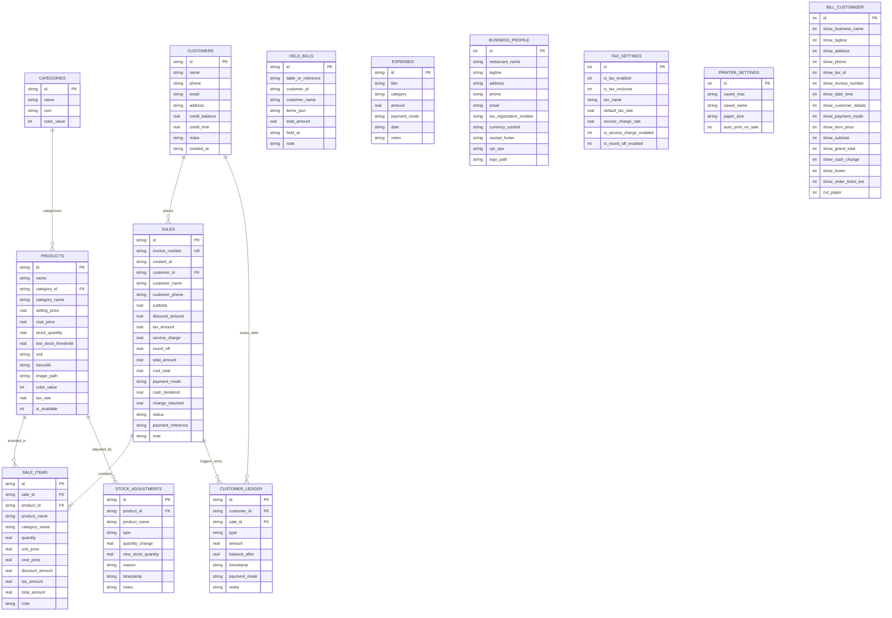

# Fundamentzz POS — Technical Architecture & Maintenance Guide

> **Tagline:** INNOVATION STARTS WITH FUNDAMENTALS  
> **Version:** v1.0.0 Enterprise  
> **Platform Target:** Cross-Platform (Android, Linux Desktop, Windows, macOS, Web)  
> **Architecture Pattern:** Clean Architecture + Provider + GetIt Dependency Injection  
> **Persistence:** Local Offline-First SQLite (via `sqflite` & `sqflite_common_ffi`) + File-Based AppData Cache  

---

## Table of Contents

1. [Executive Summary](#1-executive-summary)
2. [Project Overview](#2-project-overview)
3. [Problem Statement](#3-problem-statement)
4. [Objectives](#4-objectives)
5. [Scope](#5-scope)
6. [Requirements](#6-requirements)
7. [Technology Stack](#7-technology-stack)
8. [Architecture](#8-architecture)
9. [Project Structure](#9-project-structure)
10. [Feature Documentation](#10-feature-documentation)
11. [UI/UX Documentation](#11-uiux-documentation)
12. [Database & Data Storage](#12-database--data-storage)
13. [API & Platform Interface Documentation](#13-api--platform-interface-documentation)
14. [Security](#14-security)
15. [Testing](#15-testing)
16. [Installation & Setup](#16-installation--setup)
17. [Deployment & Release](#17-deployment--release)
18. [Error Handling & Logging](#18-error-handling--logging)
19. [Performance & Optimization](#19-performance--optimization)
20. [Limitations](#20-limitations)
21. [Future Enhancements](#21-future-enhancements)
22. [Development & Contribution Guide](#22-development--contribution-guide)
23. [Troubleshooting](#23-troubleshooting)
24. [Version History](#24-version-history)
25. [Conclusion](#25-conclusion)
26. [References](#26-references)

---

## 1. Executive Summary

**Fundamentzz** is an offline-first, enterprise-grade restaurant Point of Sale (POS) and retail management system built with Flutter and Dart. Engineered specifically for high-velocity food and beverage environments—including cafes, bistros, quick-service eateries (QSR), cloud kitchens, and bakeries—the platform delivers sub-second checkout operations with zero reliance on cloud connectivity or active Internet connections.

Operating on a strict **Clean Architecture** paradigm with transactional SQLite persistence, Fundamentzz guarantees local data sovereignty, instantaneous transaction processing, and resilience against network outages. The system integrates point-of-sale catalog management, multi-table cart holding, dynamic tax calculation (inclusive and exclusive), customer credit accounting (Khata), operational expense logging, visual financial reporting, ESC/POS Bluetooth thermal printing (58mm/80mm), and JSON-based backup snapshotting.

---

## 2. Project Overview

### 2.1 Project Metadata
- **Project Name:** Fundamentzz (Fundamentzz POS)
- **Project Type:** Standalone, Offline-First Point of Sale & Inventory Management System
- **Primary Platforms:** Android (Touch Mobile/Tablet), Linux Desktop (x86_64), Windows, macOS, Web
- **Language / SDK:** Dart 3.12.2+ / Flutter 3.12+
- **License / Distribution:** Enterprise Single-Tenant (Private)

### 2.2 Purpose
The purpose of Fundamentzz is to eliminate checkout bottlenecks, expensive recurring SaaS licensing, and operational downtime caused by Internet instability in retail food and hospitality operations. By executing all logic, transactions, and analytics locally, Fundamentzz ensures uninterrupted 24/7 business continuity.

### 2.3 Target Users
1. **Cashiers & Counter Operators:** Require high-speed order entry, instant barcode/visual product search, rapid quantity toggles, and instant receipt dispatch.
2. **Floor Servers & Waitstaff:** Need multi-table hold-and-resume capabilities to handle open dine-in tabs without blocking the counter.
3. **Store Managers & Business Owners:** Require real-time inventory visibility, low-stock threshold alerts, expense tracking, customer credit balance reconciliation, and end-of-day profit/loss analytics.

### 2.4 Main Benefits
- **Zero Cloud Downtime:** 100% functional without an active network connection.
- **Cost Efficiency:** No recurring subscription fees or cloud infrastructure billing.
- **Hardware Agnostic:** Communicates directly with standard 58mm and 80mm ESC/POS Bluetooth thermal printers and system printers.
- **Data Privacy & Control:** All sales, customer ledgers, and financial records reside entirely on the local device filesystem.

---

## 3. Problem Statement

### 3.1 Existing Problem
Commercial food outlets operate in high-pressure, time-sensitive environments where customer satisfaction hinges on checkout speed. Traditional electronic cash registers (ECRs) are rigid, lack modern visual analytics, and fail to track inventory dynamically. Conversely, modern cloud-based POS platforms introduce crippling points of failure:
- Inconsistent Internet connectivity halts customer billing.
- Cloud API latency slows transaction throughput during peak rush hours.
- Recurring SaaS subscription fees place an ongoing burden on small and medium enterprises.
- Third-party cloud storage creates vendor lock-in and raises data sovereignty concerns.

### 3.2 How Fundamentzz Solves the Problem
Fundamentzz bridges the gap between hardware cash registers and modern POS software by providing:
1. **Instantaneous Local Compute:** SQLite-backed storage delivers sub-50ms query and write response times.
2. **Resilient Cart Management:** Multi-order hold and resume functionality allows servers to park incomplete table orders and serve waiting walk-in customers immediately.
3. **Comprehensive In-App Ecosystem:** Combines inventory, customer khata (credit ledger), operational expenses, and executive reporting into a unified, responsive interface that adapts seamlessly from 5-inch handhelds to 24-inch desktop touch terminals.

---

## 4. Objectives

### 4.1 Technical Objectives
- **Clean Architectural Separation:** Maintain decoupled layers (`core`, `data`, `domain`, `presentation`) adhering strictly to SOLID principles.
- **Predictable State Flow:** Use `Provider` (`ChangeNotifier`) for reactive UI updates alongside `GetIt` for service location and dependency injection.
- **Transactional Consistency:** Execute all inventory deductions, invoice generations, and credit adjustments inside atomic SQLite transactions (`PRAGMA foreign_keys = ON`).
- **Cross-Platform Storage Strategy:** Employ `sqflite` on mobile devices and `sqflite_common_ffi` on desktop operating systems, complemented by a dedicated `appdata/` JSON file cache to prevent loss of critical store identities across database maintenance resets.

### 4.2 Functional Objectives
- Provide a responsive visual catalogue with real-time category filtering and search.
- Enable flexible tax configuration (GST, VAT, Sales Tax) supporting inclusive/exclusive calculations, service charges, discounts, and round-offs.
- Support multi-modal payment settlement: Cash (with auto-calculated change), Card, UPI Dynamic QR, and Customer Credit (Udhaar).
- Produce standardized ESC/POS thermal receipts and shareable 80mm roll PDFs formatted to user-customizable visibility toggles.
- Deliver automated daily, weekly, and monthly analytics covering gross revenue, net profit, top-selling items, and category share.

---

## 5. Scope

### 5.1 In-Scope Functionality
- Full point-of-sale billing lifecycle (cart manipulation, item discounts, bill discounts, taxes, round-off).
- Hold-and-resume order queue for multi-table dine-in workflows.
- Product catalog management with category grouping, cost/selling price tracking, barcode indexing, unit definitions, and local image attachments.
- Direct inventory stock audit adjustments with reason logging.
- Customer management with credit limits, debit/credit ledger history, and debt settlement.
- Expense tracking categorized by operational buckets.
- Executive dashboard and analytics reports powered by `fl_chart`.
- Thermal Bluetooth ESC/POS printer pairing, connection management, auto-printing, and continuous roll PDF rendering.
- JSON snapshot database backup and restore via system file share.

### 5.2 Out-of-Scope (Current Release Boundaries)
- Real-time multi-device cloud synchronization over WebSockets or Firebase.
- Direct integration with food delivery aggregators (e.g., Zomato, Swiggy, UberEats APIs).
- Integrated bank card EMV chip-and-pin reader hardware SDKs (e.g., Pax, Verifone).
- Multi-branch master inventory consolidation.
- Multi-user role-based authentication (RBAC) with PIN access per cashier.

---

## 6. Requirements

### 6.1 Functional Requirements

| Identifier | Functional Requirement Description | Priority |
| :--- | :--- | :--- |
| **FR-BIL-01** | System must allow adding items to the active cart with quantity, unit price, tax, and optional item-level discount. | Critical |
| **FR-BIL-02** | System must support holding current cart states with table/reference labels and recalling them at any time. | High |
| **FR-BIL-03** | System must automatically calculate subtotal, taxes (inclusive or exclusive), service charges, discounts, and round-offs. | Critical |
| **FR-BIL-04** | System must record completed sales with payment mode (Cash, Card, UPI, Customer Credit) and generate unique sequential invoice numbers. | Critical |
| **FR-INV-01** | System must maintain product stock levels and deduct sold item quantities atomically upon checkout. | Critical |
| **FR-INV-02** | System must allow manual stock adjustments (Add, Deduct, Set Physical Audit) with timestamped audit records. | High |
| **FR-INV-03** | System must alert users when products fall below their designated `low_stock_threshold`. | Medium |
| **FR-CUS-01** | System must maintain customer profiles and track outstanding credit balances against established credit limits. | High |
| **FR-CUS-02** | System must allow customers to pay on credit (Udhaar) and record subsequent debt settlements in a double-entry ledger. | High |
| **FR-EXP-01** | System must allow logging operational expenses with title, category, amount, payment mode, and date. | Medium |
| **FR-REP-01** | System must aggregate sales, costs, expenses, and taxes into configurable date-range analytics and profit/loss reports. | High |
| **FR-PRN-01** | System must generate ESC/POS byte sequences for 58mm and 80mm Bluetooth thermal printers. | High |
| **FR-PRN-02** | System must generate 80mm roll PDF receipts and open native system share/print dialogs. | High |
| **FR-SET-01** | System must export complete database tables into an indented JSON backup file and restore from valid snapshots. | High |
| **FR-SET-02** | System must persist store business profiles and bill customizer toggles independently of database resets. | Critical |

### 6.2 Non-Functional Requirements

- **Performance:** Cart recalculation must execute in under 16ms (60 FPS UI guarantee). Database queries must return within 50ms for datasets up to 10,000 products.
- **Reliability:** All database write operations must use ACID transactions with foreign key enforcement (`PRAGMA foreign_keys = ON`). Data corruption during abrupt application termination must be prevented by SQLite WAL/journaling.
- **Maintainability:** Codebase must adhere to Clean Architecture with zero direct coupling between presentation views and SQLite data sources.
- **Usability:** High-contrast UI elements, minimum touch targets of 48x48dp, responsive layout adaptation (NavigationRail on desktop/tablets $\ge$ 720dp, BottomNavigationBar on phones $<$ 720dp).
- **Security:** Local storage permissions restricted to application sandboxes. No unencrypted credential transmissions.
- **Portability:** Compile and execute seamlessly on Linux desktop and Android without altering business logic.

---

## 7. Technology Stack

| Component | Technology | Version | Purpose |
| :--- | :--- | :--- | :--- |
| **Framework** | Flutter | 3.12+ (SDK `^3.12.2`) | Cross-platform UI rendering engine |
| **Language** | Dart | 3.12.2+ | Core programming language |
| **State Management** | Provider | `^6.1.5+1` | Reactive state propagation via `ChangeNotifier` |
| **Dependency Injection**| GetIt | `^9.2.1` | Decoupled service locator pattern |
| **Local Database** | sqflite | `^2.4.3` | Mobile SQLite plugin |
| **Desktop DB FFI** | sqflite_common_ffi | `^2.4.2+1` | C-level SQLite FFI bindings for Linux/Windows/macOS |
| **Charts & Visuals** | fl_chart | `^1.2.0` | Interactive line charts, bar charts, and donut charts |
| **PDF Generation** | pdf / printing | `^3.13.0` / `^5.15.0` | Programmatic receipt document rendering and spooling |
| **Thermal Printing** | print_bluetooth_thermal | `^1.1.2` | Native Bluetooth RFCOMM connection handling |
| **ESC/POS Encoding** | esc_pos_utils_plus | `^2.0.4` | Low-level ESC/POS byte protocol generation |
| **File Sharing** | share_plus | `^13.3.0` | Native OS share sheet integration for backups and PDFs |
| **File System Paths** | path_provider / path | `^2.1.6` / `^1.9.1` | App sandbox directory resolution |
| **Unique Identifiers** | uuid | `^4.6.0` | Cryptographically unique UUIDv4 generation for entity IDs |
| **Typography** | google_fonts | `^8.2.1` | Typography styling (Inter font family) |
| **Image Processing** | image / image_picker | `^4.3.0` / `^1.1.2` | Product photo acquisition, resizing, and caching |
| **Permissions** | permission_handler | `^11.3.1` | Runtime Bluetooth and storage permission handling |
| **App Icons** | flutter_launcher_icons | `^0.14.4` | Automated asset icon generation for Android and iOS |

---

## 8. Architecture

Fundamentzz implements **Clean Architecture** to decouple core business entities and rules from UI frameworks, peripheral drivers, and database engines.

```
┌─────────────────────────────────────────────────────────────┐
│                     Presentation Layer                      │
│   (Views, Screens, Dialogs, Widgets, ChangeNotifiers)       │
└──────────────────────────────┬──────────────────────────────┘
                               │ Calls
                               ▼
┌─────────────────────────────────────────────────────────────┐
│                        Domain Layer                         │
│       (Entities, Business Use Cases, Repository Contracts)  │
└──────────────────────────────▲──────────────────────────────┘
                               │ Implements
                               │
┌──────────────────────────────┴──────────────────────────────┐
│                         Data Layer                          │
│   (Repository Impls, Data Models, SQLite DataSources)       │
└──────────────────────────────┬──────────────────────────────┘
                               │ Interacts with
                               ▼
┌─────────────────────────────────────────────────────────────┐
│                         Core Layer                          │
│   (SQLite FFI, ESC/POS Driver, PDF Engine, AppData Storage) │
└─────────────────────────────────────────────────────────────┘
```

### 8.1 System Architecture Diagram

```mermaid
graph TD
    subgraph Client_Presentation [Presentation Layer]
        Shell[MainNavigationShell]
        POS[NewSaleView & CartSummarySheet]
        Inv[InventoryView & StockAdjustment]
        Rep[ReportsView & ProfitLossView]
        Set[SettingsView & BillCustomizerView]
        
        BillingProv[BillingProvider]
        InvProv[InventoryProvider]
        AnalyticsProv[AnalyticsProvider]
        SettingsProv[SettingsProvider]
    end

    subgraph Business_Domain [Domain Layer - Pure Dart]
        ProcessSaleUC[ProcessSaleUseCase]
        CalcTotalUC[CalculateCartTotalUseCase]
        ManageProdUC[ManageProductsUseCase]
        AdjustStockUC[AdjustStockUseCase]
        GetAnalyticsUC[GetAnalyticsUseCase]
        BackupDataUC[BackupDataUseCase]
        
        SaleRepoContract[SaleRepository Interface]
        ProdRepoContract[ProductRepository Interface]
        CustRepoContract[CustomerRepository Interface]
        SetRepoContract[SettingsRepository Interface]
    end

    subgraph Data_Persistence [Data Layer]
        SaleRepoImpl[SaleRepositoryImpl]
        ProdRepoImpl[ProductRepositoryImpl]
        CustRepoImpl[CustomerRepositoryImpl]
        SetRepoImpl[SettingsRepositoryImpl]
        
        SQLiteDS[SqliteDataSource]
        AppDataStorage[AppDataStorageService]
    end

    subgraph Infrastructure_Hardware [Hardware & Peripherals]
        SQLiteEngine[(SQLite Database fundamentzz_pos.db)]
        AppDataFS[(AppData JSON Storage)]
        BTPrinter[Bluetooth Thermal Printer ESC/POS]
        PDFPrinter[System PDF & Print Spooler]
    end

    %% Wiring
    Shell --> POS & Inv & Rep & Set
    POS --> BillingProv
    Inv --> InvProv
    Rep --> AnalyticsProv
    Set --> SettingsProv

    BillingProv --> ProcessSaleUC & CalcTotalUC
    InvProv --> ManageProdUC & AdjustStockUC
    AnalyticsProv --> GetAnalyticsUC
    SettingsProv --> BackupDataUC

    ProcessSaleUC --> SaleRepoContract & ProdRepoContract & CustRepoContract
    ManageProdUC --> ProdRepoContract
    AdjustStockUC --> ProdRepoContract
    GetAnalyticsUC --> SaleRepoContract
    BackupDataUC --> SetRepoContract

    SaleRepoImpl -.->|Implements| SaleRepoContract
    ProdRepoImpl -.->|Implements| ProdRepoContract
    CustRepoImpl -.->|Implements| CustRepoContract
    SetRepoImpl -.->|Implements| SetRepoContract

    SaleRepoImpl --> SQLiteDS
    ProdRepoImpl --> SQLiteDS
    CustRepoImpl --> SQLiteDS
    SetRepoImpl --> SQLiteDS & AppDataStorage

    SQLiteDS --> SQLiteEngine
    AppDataStorage --> AppDataFS
    SettingsProv --> BTPrinter & PDFPrinter
```



### 8.2 Dependency Injection Map
All dependencies are registered in `lib/core/di/injection_container.dart` via `GetIt`:
- **Singletons (Lazy):** `SqliteDataSource`, `DemoDataSeeder`, `AppDataStorageService`, `ImageService`, `ReceiptGeneratorService`, `BluetoothPrinterService`, `BackupRestoreService`, Repositories (`Product`, `Sale`, `Customer`, `Expense`, `Settings`), and Use Cases.
- **Factories:** `BillingProvider`, `InventoryProvider`, `SalesHistoryProvider`, `ExpenseProvider`, `AnalyticsProvider`, `SettingsProvider`.

---

## 9. Project Structure

```
fundamentzz/
├── android/                         # Android native project and manifest configuration
├── assets/
│   └── images/                      # Static branding assets (logo.png, icons)
├── docs/                            # Deep-dive architecture and maintenance documents
├── lib/
│   ├── main.dart                    # Application entrypoint & multi-provider root
│   ├── core/                        # Cross-cutting concerns and infrastructure
│   │   ├── constants/               # AppColors, AppDimens, AppStrings
│   │   ├── database/                # DemoDataSeeder
│   │   ├── di/                      # Dependency injection (injection_container.dart)
│   │   ├── errors/                  # Failure classes (DatabaseFailure, PrinterFailure, etc.)
│   │   ├── services/                # Hardware, storage, and print utilities
│   │   │   ├── app_data_storage_service.dart   # File-based persistent JSON storage
│   │   │   ├── backup_restore_service.dart     # Backup file exporter and share invoker
│   │   │   ├── bluetooth_printer_service.dart  # ESC/POS byte generator & Bluetooth socket
│   │   │   ├── image_service.dart              # Image picker and thumbnail compressor
│   │   │   ├── printer_protocol.dart           # ESC/POS byte commands
│   │   │   └── receipt_generator_service.dart  # PDF continuous roll builder
│   │   ├── theme/                   # Material 3 light theme definition
│   │   └── utils/                   # Result<T>, CurrencyFormatter, DateFormatter
│   ├── data/                        # Data access implementation
│   │   ├── datasources/             # SqliteDataSource (schema, migrations, raw queries)
│   │   ├── models/                  # DTOs with toMap() / fromMap() serialization
│   │   └── repositories/            # Repository implementations (e.g., SaleRepositoryImpl)
│   ├── domain/                      # Enterprise business logic
│   │   ├── entities/                # Pure Dart entities (Sale, Product, Customer, etc.)
│   │   ├── repositories/            # Abstract contracts for data repositories
│   │   └── use_cases/               # Granular use cases (e.g., ProcessSaleUseCase)
│   └── presentation/                # UI and state presentation
│       ├── providers/               # ViewModels inheriting from ChangeNotifier
│       ├── views/                   # Screen widgets organized by feature domain
│       │   ├── billing/             # POS catalog, cart sheet, payment modal, receipt
│       │   ├── dashboard/           # Metrics cards, sales charts, recent tickers
│       │   ├── expenses/            # Expense logging and list views
│       │   ├── help/                # Help FAQ and About screens
│       │   ├── inventory/           # Product list, add/edit screen, category manager
│       │   ├── reports/             # P&L, category distribution, top products
│       │   ├── sales/               # Sales history log and detailed invoice inspector
│       │   ├── settings/            # Store profile, tax, printer, backup, bill customizer
│       │   ├── splash/              # Animated brand launch screen
│       │   └── main_navigation_shell.dart # Responsive shell (Rail vs BottomNav)
│       └── widgets/                 # Reusable UI components (buttons, cards, badges)
├── pubspec.yaml                     # Dependency declarations and asset links
└── test/                            # Comprehensive unit and widget tests
```

---

## 10. Feature Documentation

### 10.1 Feature: Point of Sale (POS) Billing & Visual Catalogue
- **Purpose:** Provide rapid product selection, quantity adjustment, and live cart calculation during order taking.
- **User Flow:**
  1. Cashier opens `NewSaleView`.
  2. Products load organized by categories. Cashier selects a category tab or types in the search bar.
  3. Tapping a product increments its quantity in the cart or opens `PosQuickQuantityDialog`.
  4. Cashier reviews subtotal, itemized tax, and discounts in `CartSummarySheet`.
- **Inputs:** Product IDs, quantity increments/decrements, item-level discounts, customer selection.
- **Processing:** `CalculateCartTotalUseCase` recomputes line totals, applied taxes, discounts, and round-offs.
- **Outputs:** Updated `CartItem` state and dynamic checkout button displaying grand total.
- **Dependencies:** `BillingProvider`, `ManageProductsUseCase`, `CalculateCartTotalUseCase`.
- **Error Conditions:** Out-of-stock validation warnings when quantity exceeds available inventory.
- **Security:** In-memory cart sandboxing prevents unintended mutation of stored records prior to checkout.

### 10.2 Feature: Hold & Resume Multi-Table Billing
- **Purpose:** Allow cashiers and waitstaff to park an ongoing order for a specific table or guest and start a new transaction.
- **User Flow:**
  1. Cashier clicks **Hold Bill** on an active cart.
  2. Cashier enters a reference identifier (e.g., "Table 4" or "Guest Token 12").
  3. Cart is serialized into `held_bills` SQLite table; active cart resets to empty.
  4. Cashier opens **Held Bills Dialog**, selects "Table 4", and clicks **Resume**.
  5. The cart state restores fully; the entry in `held_bills` is cleared.
- **Dependencies:** `BillingProvider`, `SqliteDataSource` (`held_bills` table).

### 10.3 Feature: Multi-Modal Checkout & Customer Credit (Khata)
- **Purpose:** Accept diverse payment types while properly handling cash change and customer debt.
- **User Flow:**
  1. Cashier taps **Checkout**. `PaymentModal` appears.
  2. Payment mode options:
     - **Cash:** Cashier enters tendered amount; system calculates return change.
     - **UPI QR:** System displays dynamic UPI QR code containing store VPA and bill total (`upi://pay?pa=...&pn=...&am=...`).
     - **Card:** Cashier marks terminal reference code.
     - **Customer Credit (Udhaar):** Cashier selects customer. If total exceeds remaining credit limit (`credit_limit - credit_balance`), checkout blocks.
  3. Upon confirmation, `ProcessSaleUseCase` writes to `sales`, `sale_items`, decrements product stock, and logs to `customer_ledger`.
- **Outputs:** Completed `Sale` entity, transaction invoice, and immediate navigation to `ReceiptView`.

### 10.4 Feature: Thermal Bluetooth Printing & PDF Invoicing
- **Purpose:** Generate tangible thermal receipts (58mm or 80mm) and shareable PDF documents.
- **User Flow:**
  1. From `ReceiptView` or `SaleDetailView`, cashier selects **Print Thermal** or **Share PDF**.
  2. If Bluetooth printing:
     - Connects to paired printer via `print_bluetooth_thermal`.
     - Translates receipt layout into ESC/POS bytes via `esc_pos_utils_plus`.
     - Feeds and cuts paper according to `BillCustomizerSettings`.
  3. If PDF:
     - `ReceiptGeneratorService` builds a continuous 80mm roll vector document.
     - Dispatches document to system print spooler or opens `share_plus` sheet.
- **Hardware Support:** Bluetooth ESC/POS receipt printers (baud 9600/115200, default paper width 58mm/80mm).

### 10.5 Feature: Dual-Persistence Settings & AppData Storage
- **Purpose:** Protect store profile (restaurant name, phone, GSTIN, UPI ID) and printer settings from inadvertent database resets or demo data loading.
- **Processing:**
  - Standard operational tables exist in `fundamentzz_pos.db`.
  - `AppDataStorageService` mirrors profile, tax, and hardware preferences into independent JSON files located in the OS application support directory (`appdata/business_profile.json`, `appdata/tax_settings.json`, etc.).
  - When the SQLite database is cleared or re-initialized, `SettingsRepositoryImpl` re-hydrates the database from the AppData files.

---

## 11. UI/UX Documentation

### 11.1 Design Principles
- **Modern High-Contrast Palette:** Crafted around deep corporate navies (`#0A192F`), vibrant brand blue (`#1565C0`), crisp card surfaces (`#FFFFFF`), and muted neutral canvas backgrounds (`#F8FAFC`).
- **Touch-First Ergonomics:** Touch targets strictly exceed 48x48dp. Critical actions (Checkout, Add, Pay) use full-width buttons with distinct color coding (Emerald Green for success/pay, Coral Red for destructive actions/void).
- **Responsive Layout Adaptation:**
  - **Screen Width $\ge$ 720dp (Desktop/Tablet):** Renders a permanent left-aligned `NavigationRail` with quick-access icons and label badges, dedicating maximum screen width to dual-column POS grids and carts.
  - **Screen Width $<$ 720dp (Mobile):** Renders a fixed 5-tab `BottomNavigationBar` with sticky bottom checkout summary sheets.

### 11.2 Screen Map & Navigation Hierarchy


---

## 12. Database & Data Storage

### 12.1 Database Engine
- **Engine:** SQLite 3 (version 3.39+)
- **Mobile Access:** `sqflite`
- **Desktop Access:** `sqflite_common_ffi` (requires native `sqlite3` runtime library)
- **Database File:** `fundamentzz_pos.db` in `getApplicationDocumentsDirectory()`
- **Concurrency & Integrity:** Foreign key enforcement enabled via `PRAGMA foreign_keys = ON`.

### 12.2 Entity-Relationship (ER) Diagram



### 12.3 Complete Data Dictionary

#### 1. `categories` Table
| Column | SQLite Type | Constraints | Description |
| :--- | :--- | :--- | :--- |
| `id` | TEXT | PRIMARY KEY | UUIDv4 string |
| `name` | TEXT | NOT NULL | Category title (e.g., "Hot Beverages") |
| `icon` | TEXT | NOT NULL DEFAULT 'restaurant' | Icon identifier key |
| `color_value` | INTEGER | NOT NULL DEFAULT 4280172510 | 32-bit ARGB hex color code |

#### 2. `products` Table
| Column | SQLite Type | Constraints | Description |
| :--- | :--- | :--- | :--- |
| `id` | TEXT | PRIMARY KEY | UUIDv4 string |
| `name` | TEXT | NOT NULL | Item name |
| `category_id` | TEXT | NOT NULL | Associated category ID |
| `category_name` | TEXT | NOT NULL | Denormalized category title |
| `selling_price` | REAL | NOT NULL | Customer retail price |
| `cost_price` | REAL | NOT NULL DEFAULT 0.0 | Wholesale cost for P&L tracking |
| `stock_quantity` | REAL | NOT NULL DEFAULT 0.0 | Current physical stock count |
| `low_stock_threshold` | REAL | NOT NULL DEFAULT 5.0 | Minimum threshold triggering alert |
| `unit` | TEXT | NOT NULL DEFAULT 'portion' | Unit of measurement (piece, kg, plate) |
| `barcode` | TEXT | NOT NULL DEFAULT '' | Scannable UPC/EAN code |
| `image_path` | TEXT | NULL | Local filesystem URI of image |
| `color_value` | INTEGER | NOT NULL DEFAULT 4280172510 | Card badge color |
| `tax_rate` | REAL | NOT NULL DEFAULT 5.0 | Specific item tax rate percentage |
| `is_available` | INTEGER | NOT NULL DEFAULT 1 | 1 = active, 0 = disabled |

#### 3. `sales` Table
| Column | SQLite Type | Constraints | Description |
| :--- | :--- | :--- | :--- |
| `id` | TEXT | PRIMARY KEY | UUIDv4 string |
| `invoice_number` | TEXT | NOT NULL UNIQUE | E.g., `INV-20260913-0001` |
| `created_at` | TEXT | NOT NULL | ISO-8601 timestamp string |
| `customer_id` | TEXT | NULL | Optional foreign key to `customers` |
| `customer_name` | TEXT | NULL | Denormalized customer name |
| `customer_phone` | TEXT | NULL | Denormalized customer phone |
| `subtotal` | REAL | NOT NULL | Sum of item gross totals |
| `discount_amount` | REAL | NOT NULL DEFAULT 0.0 | Discount deducted |
| `tax_amount` | REAL | NOT NULL DEFAULT 0.0 | Tax charged |
| `service_charge` | REAL | NOT NULL DEFAULT 0.0 | Optional dining service charge |
| `round_off` | REAL | NOT NULL DEFAULT 0.0 | Mathematical rounding variance |
| `total_amount` | REAL | NOT NULL | Final payable amount |
| `cost_total` | REAL | NOT NULL DEFAULT 0.0 | Total COGS for gross margin computation |
| `payment_mode` | TEXT | NOT NULL | `Cash`, `Card`, `UPI`, `Customer Credit` |
| `cash_tendered` | REAL | NOT NULL DEFAULT 0.0 | Cash received from customer |
| `change_returned` | REAL | NOT NULL DEFAULT 0.0 | Change given back |
| `status` | TEXT | NOT NULL DEFAULT 'completed'| `completed` or `voided` |
| `payment_reference` | TEXT | NULL | Transaction ID or card slip reference |
| `note` | TEXT | NOT NULL DEFAULT '' | Optional order memo |

#### 4. `sale_items` Table
| Column | SQLite Type | Constraints | Description |
| :--- | :--- | :--- | :--- |
| `id` | TEXT | PRIMARY KEY | UUIDv4 string |
| `sale_id` | TEXT | NOT NULL, FK `sales(id)` ON DELETE CASCADE | Parent sale reference |
| `product_id` | TEXT | NOT NULL | Item ID |
| `product_name` | TEXT | NOT NULL | Historical item name snapshot |
| `category_name` | TEXT | NOT NULL DEFAULT '' | Historical category name |
| `quantity` | REAL | NOT NULL | Units sold |
| `unit_price` | REAL | NOT NULL | Historical unit price snapshot |
| `cost_price` | REAL | NOT NULL DEFAULT 0.0 | Historical cost price snapshot |
| `discount_amount` | REAL | NOT NULL DEFAULT 0.0 | Item discount allocated |
| `tax_amount` | REAL | NOT NULL DEFAULT 0.0 | Item tax allocated |
| `total_amount` | REAL | NOT NULL | Final line item total |
| `note` | TEXT | NOT NULL DEFAULT '' | Kitchen notes (e.g., "Extra hot") |

#### 5. `held_bills` Table
Stores serialized cart snapshots (`items_json`) alongside reference labels (e.g., table numbers) to allow quick context switching without schema lock.

#### 6. `customers` & `customer_ledger` Tables
Implements a ledger system:
- Incurring credit (`Customer Credit` payment) writes a `DEBIT` record and increases `credit_balance`.
- Customer settlements write a `CREDIT` record, decrease `credit_balance`, and log payment method.

#### 7. `business_profile`, `tax_settings`, `printer_settings`, `bill_customizer` Tables
Single-row configuration tables (`id = 1`) defining enterprise metadata, tax computation rules, Bluetooth MAC address bindings, and receipt section visibility toggles.

---

## 13. API & Platform Interface Documentation

### 13.1 Offline Architecture Statement
Fundamentzz is a **100% offline-first application**. It exposes no external HTTP REST or GraphQL server endpoints, nor does it make background calls to external SaaS servers.

### 13.2 Platform Method Channels & Native Drivers
Internal communication between Dart and native host platforms occurs through standard Flutter Method Channels:

#### Bluetooth Thermal Printer Channel
- **Method Channel:** `com.fundamentzz.printer/methods`
- **Event Channel:** `com.fundamentzz.printer/events`
- **Supported Operations:**
  - `getBondedDevices()`: Returns list of paired Bluetooth devices (`name`, `address`).
  - `connect(macAddress)`: Initiates RFCOMM socket connection on UUID `00001101-0000-1000-8000-00805F9B34FB`.
  - `writeBytes(Uint8List)`: Streams raw ESC/POS byte sequence directly to printer buffer.
  - `disconnect()`: Safely closes Bluetooth socket.

### 13.3 UPI Dynamic QR Specification
To initiate instantaneous digital payments without internet-connected EDC machines, Fundamentzz generates dynamic NPCI UPI string payloads:
```
upi://pay?pa=<UPI_VPA>&pn=<RESTAURANT_NAME>&am=<TOTAL_AMOUNT>&cu=INR&tn=Bill_<INVOICE_NUMBER>
```
Rendered into standard QR matrixes on `PaymentModal` and thermal receipts via `esc_pos_utils_plus`.

---

## 14. Security

### 14.1 Implemented Security Mechanisms
1. **Local Filesystem Isolation:** All databases (`fundamentzz_pos.db`), cached images, and AppData files are stored strictly inside the OS-allocated sandboxed application directories (`getApplicationDocumentsDirectory()`).
2. **SQL Injection Immunization:** All database operations utilize parameterized queries through `sqflite` (e.g., `whereArgs: [id]`), preventing SQL injection attacks.
3. **Defensive Image Handling:** Uploaded/picked product images are decoded and re-encoded through the `image` library to strip rogue EXIF metadata and mitigate embedded payload vulnerabilities.
4. **Data Privacy:** Customer names, phone numbers, and transactional records never leave the physical device.

### 14.2 Planned Security Enhancements
- **Database Encryption:** Integration of `sqflite_sqlcipher` for 256-bit AES database encryption at rest.
- **Role-Based PIN Authentication:** Master manager PIN vs cashier PIN to authorize sales cancellations and stock overrides.

---

## 15. Testing

### 15.1 Testing Strategy
Fundamentzz uses a multi-layered verification strategy combining pure Dart unit tests for business logic, end-to-end SQLite integration tests, and Flutter widget smoke tests.

### 15.2 Test Execution Results

| Test ID | Test Suite | Test Case Description | Input / Scenario | Expected Result | Status |
| :--- | :--- | :--- | :--- | :--- | :--- |
| **TC-01** | `domain_usecases_test.dart` | Exclusive Tax Calculation | Subtotal: ₹100, Tax: 5% | Tax: ₹5.00, Grand Total: ₹105.00 | **Passed** |
| **TC-02** | `domain_usecases_test.dart` | Inclusive Tax Calculation | Item Total: ₹105, Tax: 5% | Base: ₹100.00, Tax: ₹5.00 | **Passed** |
| **TC-03** | `domain_usecases_test.dart` | Bill-Level Discount Deductions | Subtotal: ₹200, Disc: 10% | Discount: ₹20.00 applied before tax | **Passed** |
| **TC-04** | `domain_usecases_test.dart` | Mathematical Round-Off | Amount: ₹105.40, Round: On | Round-off: -₹0.40, Total: ₹105.00 | **Passed** |
| **TC-05** | `app_data_storage_test.dart`| AppData Business Profile Persistence| Save profile to disk | JSON written to `appdata/`; reloads identical data | **Passed** |
| **TC-06** | `app_data_storage_test.dart`| AppData Tax Settings Mirroring | Save tax settings | JSON written to `appdata/tax_settings.json` | **Passed** |
| **TC-07** | `bill_customizer_test.dart` | Bill Customizer Settings Serialization | Toggle `show_footer` to false | Map serializes with `show_footer: 0` | **Passed** |
| **TC-08** | `printer_test.dart` | BluetoothPrinterInfo initialization | Device name and MAC address | Object instantiates with `58mm` default paper size | **Passed** |
| **TC-09** | `printer_test.dart` | ESC/POS Test Receipt Bytes Generation | Trigger test print | Generator returns non-empty `Uint8List` ESC/POS bytes | **Passed** |
| **TC-10** | `printer_test.dart` | ESC/POS Sale Receipt with UPI QR | Sale total ₹250 with UPI VPA | Bytes contain valid QR sequence and total | **Passed** |
| **TC-11** | `printer_test.dart` | Printer respects Customizer Toggles | `cut_paper: false` | Byte stream omits paper cut command | **Passed** |
| **TC-12** | `product_and_image_test.dart`| Image Buffer Downsampling Logic | Raw image > 800x800px | Resized buffer clamped to max dimensions | **Passed** |
| **TC-13** | `product_and_image_test.dart`| Category Model Serialization | Category entity instantiation | Model copies and converts to map correctly | **Passed** |
| **TC-14** | `widget_test.dart` | CustomButton Interaction | Tap custom button | Triggers registered callback | **Passed** |
| **TC-15** | `widget_test.dart` | CustomCard Child Rendering | Wrap child widget in CustomCard | Child renders inside decorated container | **Passed** |
| **TC-16** | `widget_test.dart` | PosQuickQuantityDialog Inputs | Tap quick quantity presets (+1, +5)| Updates quantity digits accurately | **Passed** |
| **TC-17** | `widget_test.dart` | PaymentModal Header & Selection | Open checkout modal | Displays Cash and UPI options cleanly without overflow | **Passed** |
| **TC-18** | `pos_catalogue_debug_test.dart`| Desktop SQLite FFI Dynamic Library| Run unit test without native `libsqlite3.so` | Requires system `libsqlite3-dev` on Linux host | **Environment Dependent** (See Section 23) |

---

## 16. Installation & Setup

### 16.1 Prerequisites
- **Flutter SDK:** Version 3.12.0 or higher ([Install Guide](https://docs.flutter.dev/get-started/install))
- **Dart SDK:** Included with Flutter (sdk `^3.12.2`)
- **Git:** Version 2.20+

#### Linux Desktop Host Requirements
Because Fundamentzz uses `sqflite_common_ffi` on desktop platforms, the underlying C SQLite dynamic library must be installed on your Linux development machine:
```bash
sudo apt-get update
sudo apt-get install -y libsqlite3-dev sqlite3
```

### 16.2 Clone and Setup
```bash
# Clone the repository
git clone https://github.com/fundamentzz/fundamentzz.git
cd fundamentzz

# Install dependencies
flutter pub get
```

### 16.3 Launching the Application
```bash
# Run on Linux Desktop
flutter run -d linux

# Run on connected Android device/tablet
flutter run -d android

# Run on Chrome (Web Preview)
flutter run -d chrome
```

---

## 17. Deployment & Release

### 17.1 Android Release Build (APK / App Bundle)
To compile an optimized, standalone release APK for Android tablets and smartphones:
```bash
# Build standalone universal APK
flutter build apk --release

# Output artifact location:
# build/app/outputs/flutter-apk/app-release.apk
```

To build a Google Play Store App Bundle:
```bash
flutter build appbundle --release
```

### 17.2 Linux Desktop Release Build
To package a standalone native executable for Linux point-of-sale terminals:
```bash
flutter build linux --release

# Output bundle directory:
# build/linux/x64/release/bundle/
```
The resulting `bundle/` directory contains the binary `fundamentzz`, assets, and all required shared object (`.so`) libraries.

### 17.3 Updating App Launcher Icons
Brand icons are managed through `flutter_launcher_icons`. If you replace `assets/images/logo.png`, regenerate the icons using:
```bash
dart run flutter_launcher_icons
```

---

## 18. Error Handling & Logging

### 18.1 Functional Error Handling Pattern (`Result<T>`)
Fundamentzz avoids throwing unhandled exceptions across architectural boundaries. Instead, repository and use case calls return an immutable `Result<T>` monad:
```dart
abstract class Result<T> {
  final T? data;
  final Failure? failure;
  final bool isSuccess;

  const Result.success(this.data) : failure = null, isSuccess = true;
  const Result.error(this.failure) : data = null, isSuccess = false;
}
```

### 18.2 Failure Hierarchy (`lib/core/errors/failures.dart`)
- `DatabaseFailure(String message)`: Captures SQLite query exceptions, constraint violations, and migration faults.
- `ValidationFailure(String message)`: Triggered when invalid user input is detected (e.g., negative prices, empty item names, credit limit exceeded).
- `PrinterFailure(String message)`: Captures Bluetooth socket disconnections, buffer timeouts, or missing permissions.
- `BackupRestoreFailure(String message)`: Raised when importing corrupt or incompatible JSON backup snapshots.

---

## 19. Performance & Optimization

1. **Sub-16ms Cart Computation:** `CalculateCartTotalUseCase` performs pure in-memory math, calculating taxes, item discounts, bill discounts, and rounding with zero database calls during cart interactions.
2. **IndexedStack View Caching:** The primary layout shell (`MainNavigationShell`) wraps the 5 core tabs in an `IndexedStack`. Switching between POS Billing, Inventory, and Reports preserves scroll offsets, active search filters, and selected product categories without rebuilding the widget tree.
3. **Database Indexing:** Unique indexes on `sales(invoice_number)` and indexed foreign keys on `sale_items(sale_id)` and `customer_ledger(customer_id)` maintain sub-50ms query times over tens of thousands of historical records.
4. **Thumbnail Compression:** When attaching product images, `ImageService` scales down camera and gallery photos to maximum bounds of 800x800px and compresses JPEG quality to 80%, keeping the database lightweight and memory consumption minimal.

---

## 20. Limitations

- **Single Terminal Operation:** Transactions are stored on the local device. Simultaneous billing across multiple mobile devices does not automatically synchronize to a shared central database in real time.
- **Camera-Based Barcode Scanning:** Barcode input currently accepts external USB/Bluetooth HID hardware barcode scanners or manual entry. Integrated camera scanning requires mobile camera permissions.
- **Unencrypted Local Database:** In the current release, `fundamentzz_pos.db` is stored as standard unencrypted SQLite. Physical access to a rooted device filesystem allows direct file inspection.

---

## 21. Future Enhancements

- **Local Area Network (LAN) Multi-Terminal Sync:** Implement a local master-slave synchronization protocol over mDNS/HTTP so kitchen display terminals and mobile waitstaff tablets can sync with the main cash counter without requiring an Internet connection.
- **Kitchen Display System (KDS):** A dedicated live kitchen order ticket (KOT) view with audio chime alerts and fulfillment status tracking.
- **Cloud Backup Integration:** Optional automated Google Drive / WebDAV export for off-site backup snapshots.
- **Database Encryption (SQLCipher):** Encrypting `fundamentzz_pos.db` at rest with a user-defined master passphrase.

---

## 22. Development & Contribution Guide

### 22.1 Coding Standards
- Follow standard Dart guidelines enforced by `flutter_lints`.
- Maintain the Clean Architecture layer boundaries:
  - Domain layer must **never** import from `presentation/`, `data/`, or third-party Flutter packages (pure Dart only).
  - Use Cases must represent a single business action with an `execute()` or descriptive method name.
  - Presentation views must delegate business logic to their respective `ChangeNotifier` providers.

### 22.2 Git Workflow
- `main`: Production-ready releases.
- `develop`: Primary integration branch.
- Feature branches: `feature/feature-name` branched off `develop`.
- Commit convention: Conventional Commits (`feat:`, `fix:`, `docs:`, `refactor:`, `test:`).

---

## 23. Troubleshooting

### 23.1 Missing `libsqlite3.so` on Linux
- **Symptom:** Running tests or the Linux desktop app throws `SqfliteFfiException: Failed to load dynamic library 'libsqlite3.so'`.
- **Cause:** Desktop SQLite FFI requires the native development headers of SQLite installed on the Linux host.
- **Solution:** Execute:
  ```bash
  sudo apt-get update && sudo apt-get install -y libsqlite3-dev
  ```

### 23.2 Bluetooth Printer Not Found or Fails to Connect
- **Symptom:** Discovered devices list is empty or connection fails immediately.
- **Solution:**
  1. Ensure the thermal printer is powered on and paired with the host device in system Bluetooth settings first.
  2. On Android 12+, ensure `BLUETOOTH_SCAN` and `BLUETOOTH_CONNECT` runtime permissions have been granted in application settings.
  3. Ensure location services (GPS) are toggled ON (mandated by Android OS for Bluetooth discovery).

### 23.3 Database Reset Did Not Clear Business Profile
- **Explanation:** This is an intentional feature of the dual-storage architecture. Store profile data is mirrored in `appdata/business_profile.json` so store owners do not lose their business name, tax registration number, and logo when performing operational database maintenance. To perform a 100% factory wipe, delete the `appdata/` directory.

---

## 24. Version History

| Version | Date | Description |
| :--- | :--- | :--- |
| **v1.0.0 Enterprise** | September 2026 | Initial enterprise release. Complete Clean Architecture implementation, offline SQLite storage, POS billing, multi-table hold/resume, customer khata ledger, visual reporting, ESC/POS Bluetooth printing, 80mm PDF generation, dual-storage AppData persistence, and JSON backup/restore. |

---

## 25. Conclusion

**Fundamentzz** delivers a robust, modern, and completely self-sufficient point-of-sale ecosystem for food and retail businesses. By pairing the speed and aesthetics of Flutter with the rock-solid reliability of transactional SQLite and Clean Architecture, Fundamentzz offers small and medium business owners complete operational autonomy, sub-second checkout speeds, and zero dependence on cloud infrastructure.

---

## 26. References

- [Flutter Official Documentation](https://docs.flutter.dev/)
- [Dart Language Guide](https://dart.dev/guides)
- [Clean Architecture (Robert C. Martin)](https://blog.cleancoder.com/uncle-bob/2012/08/13/the-clean-architecture.html)
- [SQLite Documentation & SQL Syntax](https://www.sqlite.org/docs.html)
- [sqflite_common_ffi Package](https://pub.dev/packages/sqflite_common_ffi)
- [ESC/POS Command Reference](https://reference.epson-biz.com/modules/ref_escpos/index.php)
- [fl_chart Documentation](https://pub.dev/packages/fl_chart)
